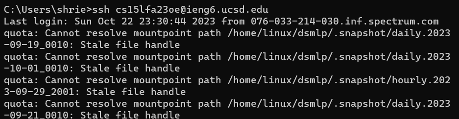

**Lab Report 2**  
PART 1  

   
   Code for String Sever:  
   ~~~
  import java.io.IOException;
  import java.net.URI;
  
  class Handler implements URLHandler {
  
      int num = 0;
  
      public String handleRequest(URI url) {
          if (url.getPath().contains("/add-message")) {
              String[] parameters = url.getQuery().split("=");
              if (parameters[0].equals("s")) {
                  num += 1;
                  return num + "." + parameters[1] + "\n";
              }
              return "404 Not Found!";
          }
          return "";
      }
  }
  
  class StringServer {
      public static void main(String[] args) throws IOException {
          if(args.length == 0){
              System.out.println("Missing port number! Try any number between 1024 to 49151");
              return;
          }
  
          int port = Integer.parseInt(args[0]);
  
          Server.start(port, new Handler());
      }
  }
   ~~~

   1. URLHandler and StringServer methods are called.  
   2. The relevant arguments for URLHandler are the string passed in after the = and gets stored in parameters (for eg, parameters[1] is "How are you". The value is a string. 
   3. The field num is being incremented by 1 as and when a new string is added.  
 

PART 2  
1. 
~~~
Your public key has been saved in C:\Users\shrie/.ssh/id_rsa.pub
~~~

2.
~~~
[cs15lfa23oe@ieng6-203]:.ssh:28$ cd ~/.ssh/
[cs15lfa23oe@ieng6-203]:.ssh:29$ ls
known_hosts
[cs15lfa23oe@ieng6-203]:.ssh:30$ ls ~/.ssh/known_hosts
/home/linux/ieng6/cs15lfa23/cs15lfa23oe/.ssh/known_hosts
~~~

3. 
  
~~~
C:\Users\shrie>ssh cs15lfa23oe@ieng6.ucsd.edu
Last login: Sun Oct 22 23:30:44 2023 from 076-033-214-030.inf.spectrum.com
quota: Cannot resolve mountpoint path /home/linux/dsmlp/.snapshot/daily.2023-09-19_0010: Stale file handle
quota: Cannot resolve mountpoint path /home/linux/dsmlp/.snapshot/daily.2023-10-01_0010: Stale file handle
quota: Cannot resolve mountpoint path /home/linux/dsmlp/.snapshot/hourly.2023-09-29_2001: Stale file handle
quota: Cannot resolve mountpoint path /home/linux/dsmlp/.snapshot/daily.2023-09-21_0010: Stale file handle
quota: Cannot resolve mountpoint path /home/linux/dsmlp/.snapshot/daily.2023-09-30_0010: Stale file handle
quota: Cannot resolve mountpoint path /home/linux/dsmlp/.snapshot/hourly.2023-09-29_1601: Stale file handle
quota: Cannot resolve mountpoint path /home/linux/dsmlp/.snapshot/hourly.2023-09-30_0801: Stale file handle
quota: Cannot resolve mountpoint path /home/linux/dsmlp/.snapshot/weekly.2023-09-03_0015: Stale file handle
quota: Cannot resolve mountpoint path /home/linux/dsmlp/.snapshot/hourly.2023-09-29_1201: Stale file handle
quota: Cannot resolve mountpoint path /home/linux/dsmlp/.snapshot/daily.2023-09-26_0010: Stale file handle
quota: Cannot resolve mountpoint path /home/linux/dsmlp/.snapshot/daily.2023-09-28_0010: Stale file handle
quota: Cannot resolve mountpoint path /home/linux/dsmlp/.snapshot/hourly.2023-09-30_1201: Stale file handle
quota: Cannot resolve mountpoint path /home/linux/dsmlp/.snapshot/daily.2023-09-23_0010: Stale file handle
quota: Cannot resolve mountpoint path /home/linux/dsmlp/.snapshot/daily.2023-09-18_0010: Stale file handle
quota: Cannot resolve mountpoint path /home/linux/dsmlp/.snapshot/hourly.2023-09-30_1601: Stale file handle
quota: Cannot resolve mountpoint path /home/linux/dsmlp/.snapshot/hourly.2023-09-30_2001: Stale file handle
quota: Cannot resolve mountpoint path /home/linux/dsmlp/.snapshot/weekly.2023-09-10_0015: Stale file handle
quota: Cannot resolve mountpoint path /home/linux/dsmlp/.snapshot/hourly.2023-10-01_0801: Stale file handle
quota: Cannot resolve mountpoint path /home/linux/dsmlp/.snapshot/weekly.2023-09-17_0015: Stale file handle
quota: Cannot resolve mountpoint path /home/linux/dsmlp/.snapshot/daily.2023-09-24_0010: Stale file handle
quota: Cannot resolve mountpoint path /home/linux/dsmlp/.snapshot/daily.2023-09-22_0010: Stale file handle
quota: Cannot resolve mountpoint path /home/linux/dsmlp/.snapshot/daily.2023-09-20_0010: Stale file handle
quota: Cannot resolve mountpoint path /home/linux/dsmlp/.snapshot/daily.2023-09-29_0010: Stale file handle
quota: Cannot resolve mountpoint path /home/linux/dsmlp/.snapshot/daily.2023-09-27_0010: Stale file handle
quota: Cannot resolve mountpoint path /home/linux/dsmlp/.snapshot/daily.2023-09-25_0010: Stale file handle
quota: Cannot resolve mountpoint path /home/linux/staff/.snapshot/daily.2023-09-19_0010: Stale file handle
quota: Cannot resolve mountpoint path /home/linux/staff/.snapshot/daily.2023-10-01_0010: Stale file handle
quota: Cannot resolve mountpoint path /home/linux/staff/.snapshot/hourly.2023-09-29_2001: Stale file handle
quota: Cannot resolve mountpoint path /home/linux/staff/.snapshot/daily.2023-09-21_0010: Stale file handle
quota: Cannot resolve mountpoint path /home/linux/staff/.snapshot/daily.2023-09-30_0010: Stale file handle
quota: Cannot resolve mountpoint path /home/linux/staff/.snapshot/hourly.2023-09-29_1601: Stale file handle
quota: Cannot resolve mountpoint path /home/linux/staff/.snapshot/hourly.2023-09-30_0801: Stale file handle
quota: Cannot resolve mountpoint path /home/linux/staff/.snapshot/weekly.2023-09-03_0015: Stale file handle
quota: Cannot resolve mountpoint path /home/linux/staff/.snapshot/hourly.2023-09-29_1201: Stale file handle
quota: Cannot resolve mountpoint path /home/linux/staff/.snapshot/daily.2023-09-26_0010: Stale file handle
quota: Cannot resolve mountpoint path /home/linux/staff/.snapshot/daily.2023-09-28_0010: Stale file handle
quota: Cannot resolve mountpoint path /home/linux/staff/.snapshot/hourly.2023-09-30_1201: Stale file handle
quota: Cannot resolve mountpoint path /home/linux/staff/.snapshot/daily.2023-09-23_0010: Stale file handle
quota: Cannot resolve mountpoint path /home/linux/staff/.snapshot/daily.2023-09-18_0010: Stale file handle
quota: Cannot resolve mountpoint path /home/linux/staff/.snapshot/hourly.2023-09-30_1601: Stale file handle
quota: Cannot resolve mountpoint path /home/linux/staff/.snapshot/hourly.2023-09-30_2001: Stale file handle
quota: Cannot resolve mountpoint path /home/linux/staff/.snapshot/weekly.2023-09-10_0015: Stale file handle
quota: Cannot resolve mountpoint path /home/linux/staff/.snapshot/hourly.2023-10-01_0801: Stale file handle
quota: Cannot resolve mountpoint path /home/linux/staff/.snapshot/weekly.2023-09-17_0015: Stale file handle
quota: Cannot resolve mountpoint path /home/linux/staff/.snapshot/daily.2023-09-24_0010: Stale file handle
quota: Cannot resolve mountpoint path /home/linux/staff/.snapshot/daily.2023-09-22_0010: Stale file handle
quota: Cannot resolve mountpoint path /home/linux/staff/.snapshot/daily.2023-09-20_0010: Stale file handle
quota: Cannot resolve mountpoint path /home/linux/staff/.snapshot/daily.2023-09-29_0010: Stale file handle
quota: Cannot resolve mountpoint path /home/linux/staff/.snapshot/daily.2023-09-27_0010: Stale file handle
quota: Cannot resolve mountpoint path /home/linux/staff/.snapshot/daily.2023-09-25_0010: Stale file handle
Hello cs15lfa23oe, you are currently logged into ieng6-203.ucsd.edu

You are using 0% CPU on this system

Cluster Status
Hostname     Time    #Users  Load  Averages
ieng6-201   23:35:01   14  0.61,   0.56,   0.55
ieng6-202   23:35:01   21  26.26,  25.32,  25.12
ieng6-203   23:35:01   14  14.91,  14.78,  15.06

Sun Oct 22, 2023 11:39pm - Prepping cs15lfa23
[cs15lfa23oe@ieng6-203]:~:33$

~~~
 

PART 3  
I can login to my ucsd server without needing a password every single time on my local computer
 

