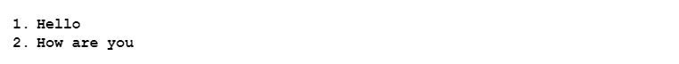

**Lab Report 2**  
PART 1  

   
   Code for String Sever:  
   ~~~
import java.io.IOException;
import java.net.URI;

class Handler implements URLHandler {

    int num = 0;

    public String handleRequest(URI url) {
        if (url.getPath().contains("/add-message")) {
            String[] parameters = url.getQuery().split("=");
            if (parameters[0].equals("s")) {
                num += 1;
                return (num + ". " + parameters[1] + "\n");
            }
            return "404 Not Found!";
        }
        return "";
    }
}

public class StringServer {
    public static void main(String[] args) throws IOException {
        if (args.length == 0) {
            System.out.println("Missing port number! Try any number between 1024 to 49151");
            return;
        }

        int port = Integer.parseInt(args[0]);
        Server.start(port, new Handler());
    }
}

   ~~~
  

   1. handle and handlerRequest method is called  
   2. The relevant arguments for handle are 'ret' which contains the value passed in after the = and gets stored in parameters (for eg, parameters[1] is "1. Hello\n"). 
   3. The field num is being incremented by 1 as and when a new string is added. So right now it went from 0 to 1.  
 

  

   1. handle and handlerRequest method is called  
   2. The relevant arguments for handle are the values passed in after the = and gets stored in parameters -> "1. Hello\n 2. How are you\n". 
   3. The field num is being incremented by 1 as and when a new string is added. So right now it went from 1 to 2.  
 

PART 2  
using ls:  
  

1. 
~~~
C:\Users\shrie/.ssh/id_rsa
~~~

2.
~~~
C:\Users\shrie/.ssh/id_rsa.pub
~~~

3. 
  

 

PART 3  
I can login to my ucsd server without needing a password every single time on my local computer
 

