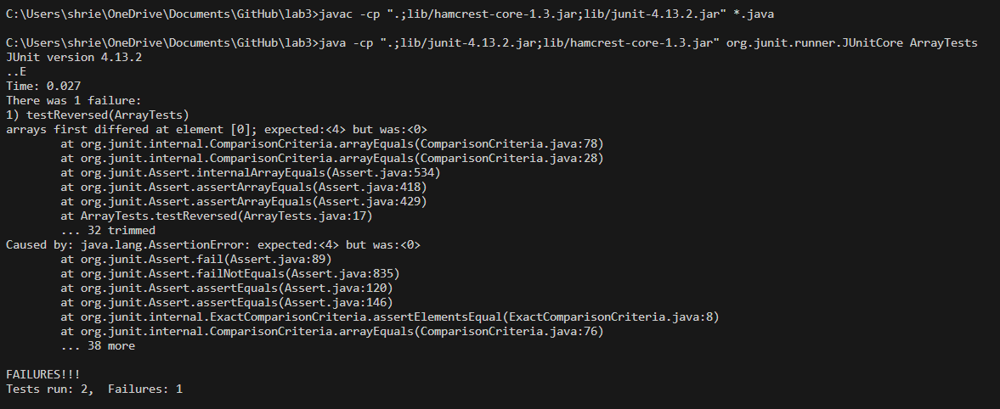

**Lab Report 3**  
PART 1  
Choosing the revered method to test:
 

1. Failure-inducing input  

~~~
@Test
  public void testReversed() {
    int[] input = {1,2,3,4};
    int[] expected = {4,3,2,1};
    assertArrayEquals(expected,ArrayExamples.reversed(input));
  }
~~~
 
2. Input that does not induce Failure  

~~~
@Test
    public void testReversedNoFailure() {
        int[] input = {5, 10, 15, 20};
        int[] expected = {0,0,0,0};
        assertArrayEquals(expected, ArrayExamples.reversed(input));
    }
~~~
 
3. Symptom  

 

